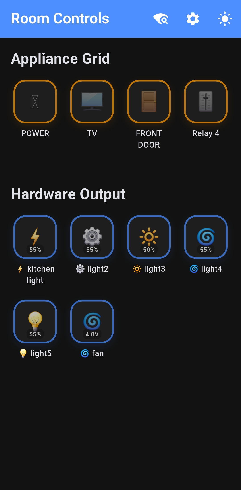
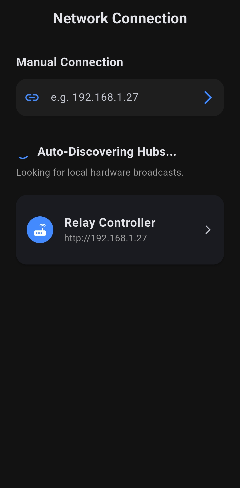
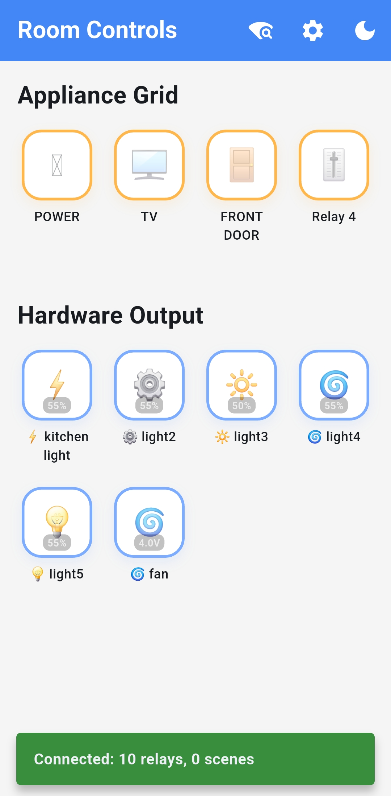
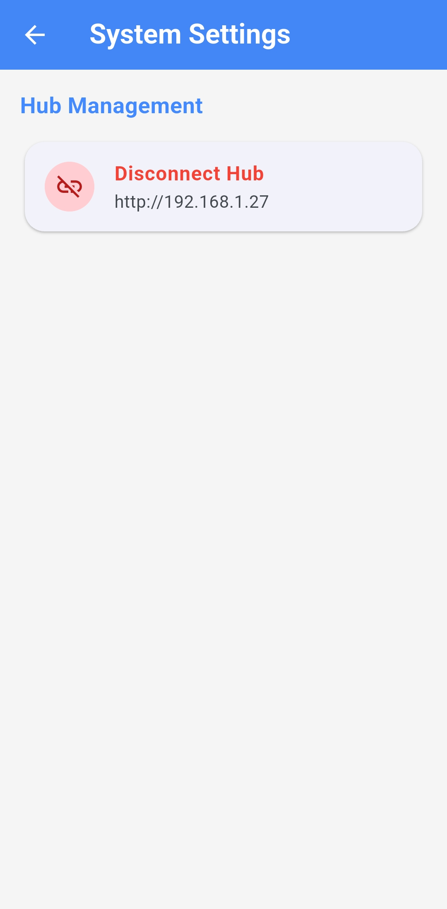

# Relay Controller App


A modern Flutter application developed during my internship for controlling smart appliances over a local network. The application communicates with a backend server and embedded hardware to discover devices, control relays, execute scenes, manage PWM outputs, and configure connected hardware.

---
## 📥 Download APK

[](https://github.com/Akashv-deve/relay-controller-app/releases/latest)

> Download the latest stable Android release of Relay Controller from GitHub Releases.

# Preview



---

# Features

- Automatic Hub Discovery using UDP Broadcast
- Manual Hub Connection using IP Address
- Smart Relay Control
- PWM Brightness / Fan Speed Control
- Analog Output Monitoring
- Scene Execution and Management
- Dark & Light Theme Support
- Password Protected Settings
- Persistent Hub Connection using Local Storage
- Responsive Material Design UI
- Smooth Animations and Error Handling

---

# Tech Stack

- Flutter
- Dart
- REST API
- UDP Broadcast Discovery
- SharedPreferences
- Material Design
- Stateful Widgets
- Git
- GitHub

---

# Architecture

```text
Flutter App
      │
      ▼
REST API / UDP
      │
      ▼
Backend Server
      │
      ▼
Microcontroller
      │
      ▼
Relay Hardware
```

---

# Project Structure

```text
lib/
│
├── models/
│   ├── smart_device.dart
│   └── smart_scene.dart
│
├── services/
│   ├── hub_service.dart
│   └── udp_broadcast_listener.dart
│
├── themes/
│   └── app_theme.dart
│
└── main.dart
```

---

# Screenshots

## Network Discovery

| Light Theme | Dark Theme |
|-------------|------------|
|  |  |

---

## Dashboard

| Light Theme | Dark Theme |
|-------------|------------|
|  |  |

---

## Scene Management

| Meeting Scene | AV Room Scene |
|---------------|---------------|
|  |  |

---

## PWM Live Control

| 55% Output | 30% Output |
|-------------|------------|
|  |  |

---

## Output State Control

| Power Output | TV Output |
|--------------|-----------|
|  |  |

---

## Hub Management



---

# Installation

```bash
git clone https://github.com/Akashv-deve/RelayController.git

cd RelayController

flutter pub get

flutter run
```

---

# Future Improvements

- MQTT Support
- Voice Assistant Integration
- Offline Device Synchronization
- Multi-Room Management
- Improved Modular Architecture
- User Authentication

---

# Disclaimer

This repository contains only the Flutter frontend application developed during my internship.

The backend server, embedded firmware, hardware design, and device firmware were developed separately as part of the internship environment and are therefore not included in this repository.
